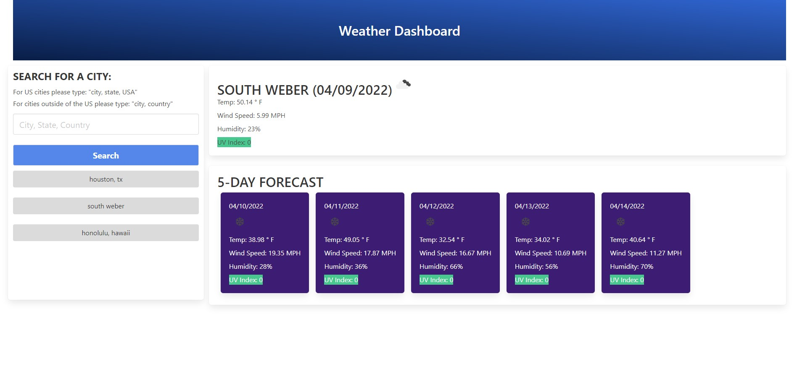

# weather-dashboard
This application helps users better plan their activities around the weather by allowing users to search for the weather of local area any where in the world and get a 5-day weather forecast.

##Technologies Used

HTML
CSS
Bulma
JavaScript
JQuery
Moment.js
Open Weather Map Web API

##Screenshot

##Deployed Application
https://ernypoo92.github.io/weather-dashboard/
